# OpsQuery - Comprehensive Workflow Chart

## System Overview

OpsQuery is a real-time query management system that facilitates seamless communication between Operations, Sales, and Credit teams. The system follows a structured workflow where Operations creates queries, and Sales/Credit teams respond with appropriate actions.

---

## 🎯 Complete System Workflow

### 1. Authentication & Role Management
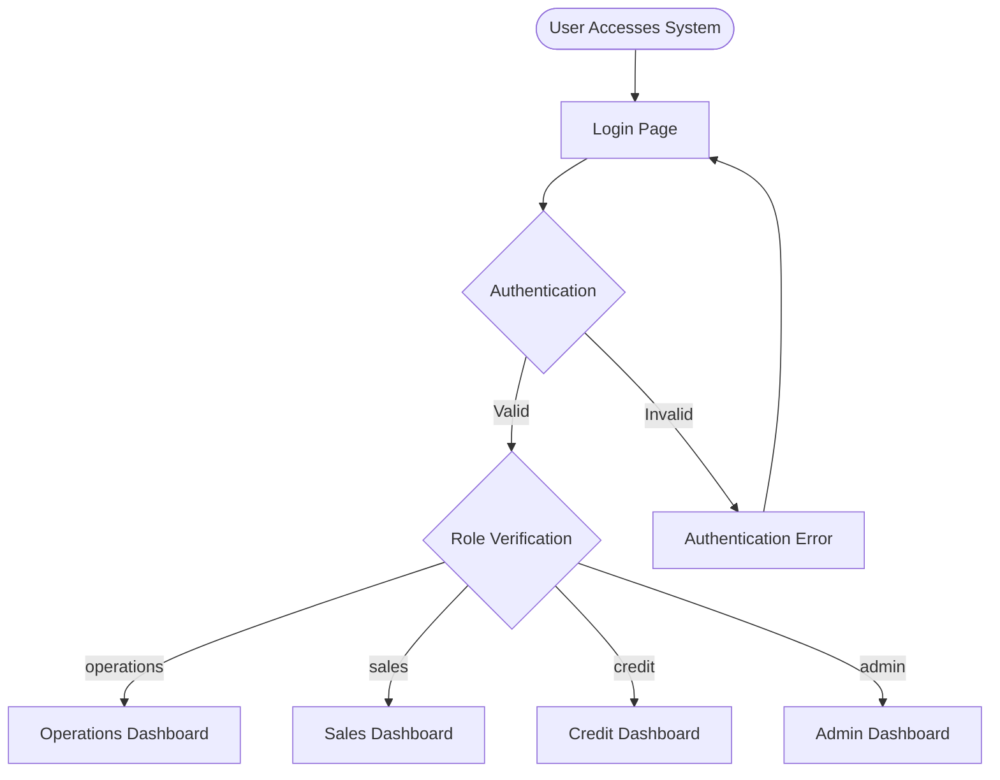
```mermaid
flowchart TB
    Start([User Accesses System]) --> Login[Login Page]
    Login --> AuthCheck{Authentication}
    AuthCheck -->|Valid| RoleCheck{Role Verification}
    AuthCheck -->|Invalid| LoginError[Authentication Error]
    LoginError --> Login
    
    RoleCheck -->|operations| OpsAuth[Operations Dashboard]
    RoleCheck -->|sales| SalesAuth[Sales Dashboard]
    RoleCheck -->|credit| CreditAuth[Credit Dashboard]
    RoleCheck -->|admin| AdminAuth[Admin Dashboard]
```

### 2. Operations Team Workflow (Query Creators)

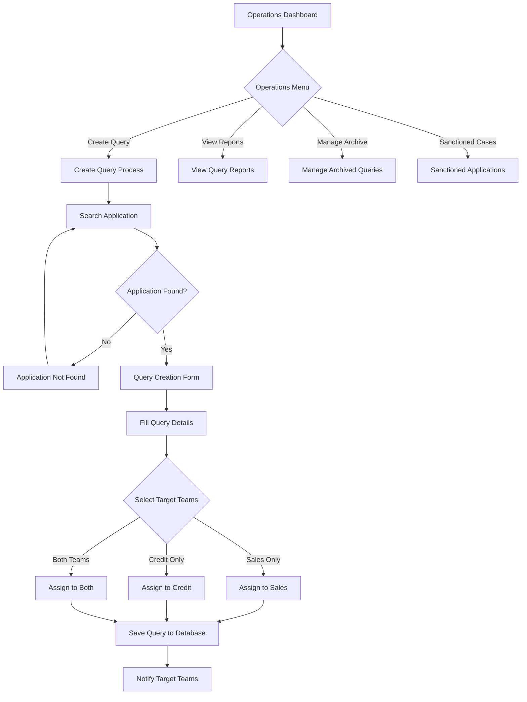
```mermaid
flowchart TB
    OpsAuth[Operations Dashboard] --> OpsMenu{Operations Menu}
    OpsMenu -->|Create Query| CreateQueryFlow[Create Query Process]
    OpsMenu -->|View Reports| ViewReports[View Query Reports]
    OpsMenu -->|Manage Archive| ManageArchive[Manage Archived Queries]
    OpsMenu -->|Sanctioned Cases| SanctionedCases[Sanctioned Applications]
    
    CreateQueryFlow --> SearchApp[Search Application]
    SearchApp --> AppFound{Application Found?}
    AppFound -->|No| AppNotFound[Application Not Found]
    AppFound -->|Yes| QueryForm[Query Creation Form]
    AppNotFound --> SearchApp
    
    QueryForm --> FillDetails[Fill Query Details]
    FillDetails --> SelectTeams{Select Target Teams}
    SelectTeams -->|Sales Only| ToSalesTeam[Assign to Sales]
    SelectTeams -->|Credit Only| ToCreditTeam[Assign to Credit]
    SelectTeams -->|Both Teams| ToBothTeams[Assign to Both]
    
    ToSalesTeam --> SaveQuery[Save Query to Database]
    ToCreditTeam --> SaveQuery
    ToBothTeams --> SaveQuery
    SaveQuery --> NotifyTeams[Notify Target Teams]
```

### 3. Sales Team Workflow (Responders)

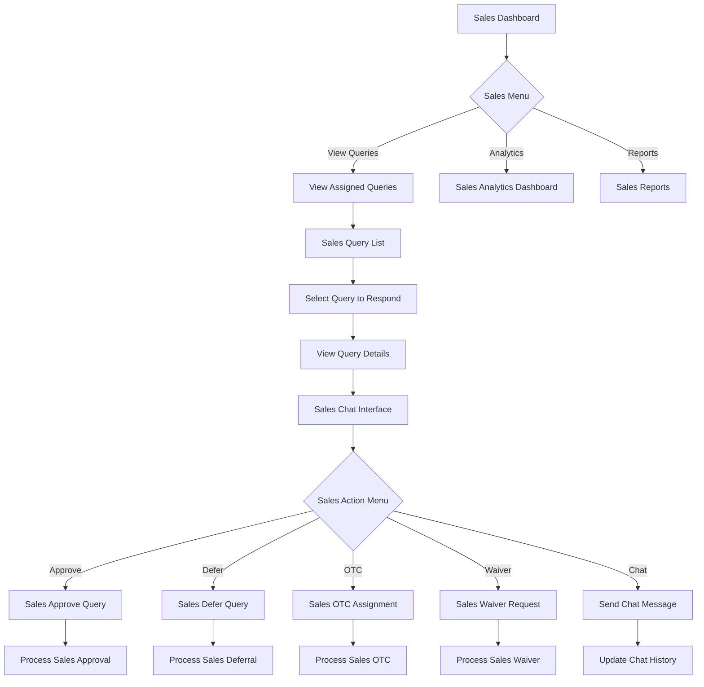
```mermaid
flowchart TB
    SalesAuth[Sales Dashboard] --> SalesMenu{Sales Menu}
    SalesMenu -->|View Queries| ViewSalesQueries[View Assigned Queries]
    SalesMenu -->|Analytics| SalesAnalytics[Sales Analytics Dashboard]
    SalesMenu -->|Reports| SalesReports[Sales Reports]
    
    ViewSalesQueries --> SalesQueryList[Sales Query List]
    SalesQueryList --> SelectSalesQuery[Select Query to Respond]
    SelectSalesQuery --> SalesQueryDetails[View Query Details]
    SalesQueryDetails --> SalesChatInterface[Sales Chat Interface]
    
    SalesChatInterface --> SalesActionMenu{Sales Action Menu}
    SalesActionMenu -->|Approve| SalesApprove[Sales Approve Query]
    SalesActionMenu -->|Defer| SalesDefer[Sales Defer Query]
    SalesActionMenu -->|OTC| SalesOTC[Sales OTC Assignment]
    SalesActionMenu -->|Waiver| SalesWaiver[Sales Waiver Request]
    SalesActionMenu -->|Chat| SalesChat[Send Chat Message]
    
    SalesApprove --> SalesApproveProcess[Process Sales Approval]
    SalesDefer --> SalesDeferProcess[Process Sales Deferral]
    SalesOTC --> SalesOTCProcess[Process Sales OTC]
    SalesWaiver --> SalesWaiverProcess[Process Sales Waiver]
    SalesChat --> UpdateSalesChat[Update Chat History]
```

### 4. Credit Team Workflow (Responders)
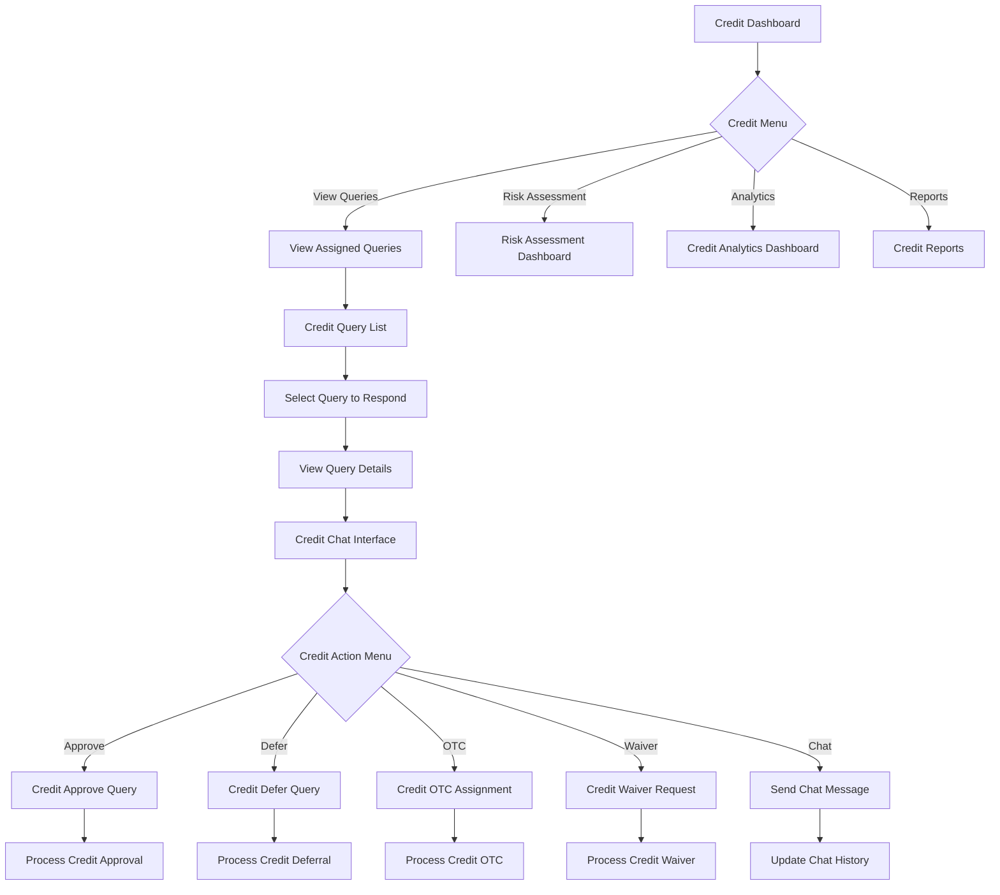
```mermaid
flowchart TB
    CreditAuth[Credit Dashboard] --> CreditMenu{Credit Menu}
    CreditMenu -->|View Queries| ViewCreditQueries[View Assigned Queries]
    CreditMenu -->|Risk Assessment| CreditRisk[Risk Assessment Dashboard]
    CreditMenu -->|Analytics| CreditAnalytics[Credit Analytics Dashboard]
    CreditMenu -->|Reports| CreditReports[Credit Reports]
    
    ViewCreditQueries --> CreditQueryList[Credit Query List]
    CreditQueryList --> SelectCreditQuery[Select Query to Respond]
    SelectCreditQuery --> CreditQueryDetails[View Query Details]
    CreditQueryDetails --> CreditChatInterface[Credit Chat Interface]
    
    CreditChatInterface --> CreditActionMenu{Credit Action Menu}
    CreditActionMenu -->|Approve| CreditApprove[Credit Approve Query]
    CreditActionMenu -->|Defer| CreditDefer[Credit Defer Query]
    CreditActionMenu -->|OTC| CreditOTC[Credit OTC Assignment]
    CreditActionMenu -->|Waiver| CreditWaiver[Credit Waiver Request]
    CreditActionMenu -->|Chat| CreditChat[Send Chat Message]
    
    CreditApprove --> CreditApproveProcess[Process Credit Approval]
    CreditDefer --> CreditDeferProcess[Process Credit Deferral]
    CreditOTC --> CreditOTCProcess[Process Credit OTC]
    CreditWaiver --> CreditWaiverProcess[Process Credit Waiver]
    CreditChat --> UpdateCreditChat[Update Chat History]
```

### 5. Query Action Processing Engine
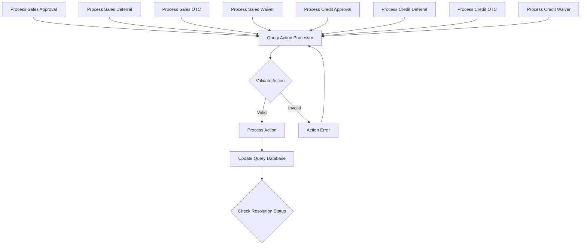
```mermaid
flowchart TB
    SalesApproveProcess[Process Sales Approval] --> ActionProcessor[Query Action Processor]
    SalesDeferProcess[Process Sales Deferral] --> ActionProcessor
    SalesOTCProcess[Process Sales OTC] --> ActionProcessor
    SalesWaiverProcess[Process Sales Waiver] --> ActionProcessor
    
    CreditApproveProcess[Process Credit Approval] --> ActionProcessor
    CreditDeferProcess[Process Credit Deferral] --> ActionProcessor
    CreditOTCProcess[Process Credit OTC] --> ActionProcessor
    CreditWaiverProcess[Process Credit Waiver] --> ActionProcessor
    
    ActionProcessor --> ValidateAction{Validate Action}
    ValidateAction -->|Valid| ProcessAction[Process Action]
    ValidateAction -->|Invalid| ActionError[Action Error]
    ActionError --> ActionProcessor
    
    ProcessAction --> UpdateDatabase[Update Query Database]
    UpdateDatabase --> CheckResolution{Check Resolution Status}
```

### 6. Query Resolution & Archive
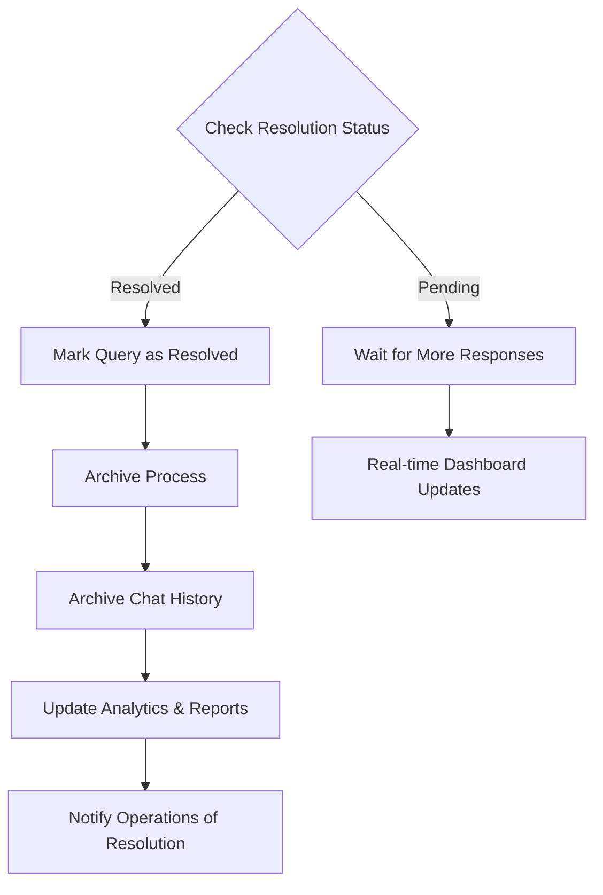
```mermaid
flowchart TB
    CheckResolution{Check Resolution Status} -->|Resolved| MarkResolved[Mark Query as Resolved]
    CheckResolution -->|Pending| WaitForMore[Wait for More Responses]
    
    MarkResolved --> ArchiveProcess[Archive Process]
    ArchiveProcess --> ArchiveChat[Archive Chat History]
    ArchiveChat --> UpdateReports[Update Analytics & Reports]
    UpdateReports --> NotifyOperations[Notify Operations of Resolution]
    
    WaitForMore --> RealTimeUpdates[Real-time Dashboard Updates]
```

### 7. Real-time Update System
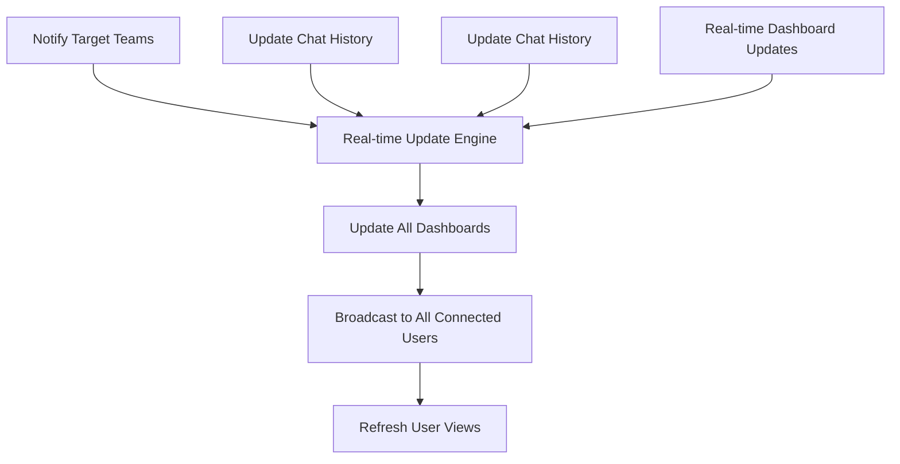
```mermaid
flowchart TB
    NotifyTeams[Notify Target Teams] --> RealTimeEngine[Real-time Update Engine]
    UpdateSalesChat[Update Chat History] --> RealTimeEngine
    UpdateCreditChat[Update Chat History] --> RealTimeEngine
    RealTimeUpdates[Real-time Dashboard Updates] --> RealTimeEngine
    
    RealTimeEngine --> UpdateDashboards[Update All Dashboards]
    UpdateDashboards --> BroadcastUpdates[Broadcast to All Connected Users]
    BroadcastUpdates --> RefreshViews[Refresh User Views]
```

### 8. Admin Panel Workflow
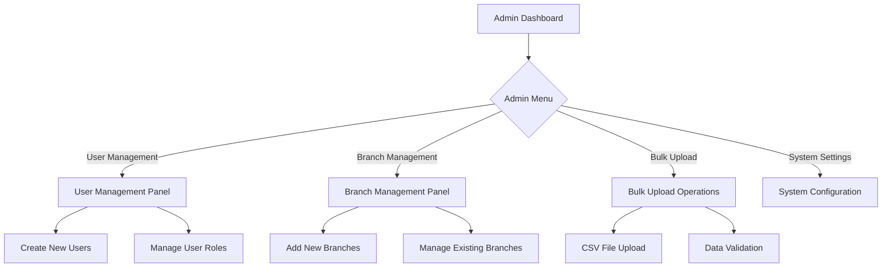
```mermaid
flowchart TB
    AdminAuth[Admin Dashboard] --> AdminMenu{Admin Menu}
    AdminMenu -->|User Management| UserManagement[User Management Panel]
    AdminMenu -->|Branch Management| BranchManagement[Branch Management Panel]
    AdminMenu -->|Bulk Upload| BulkUpload[Bulk Upload Operations]
    AdminMenu -->|System Settings| SystemSettings[System Configuration]
    
    UserManagement --> CreateUser[Create New Users]
    UserManagement --> ManageRoles[Manage User Roles]
    BranchManagement --> AddBranch[Add New Branches]
    BranchManagement --> ManageBranches[Manage Existing Branches]
    BulkUpload --> CSVUpload[CSV File Upload]
    BulkUpload --> DataValidation[Data Validation]
```

### 9. Data Management & Storage
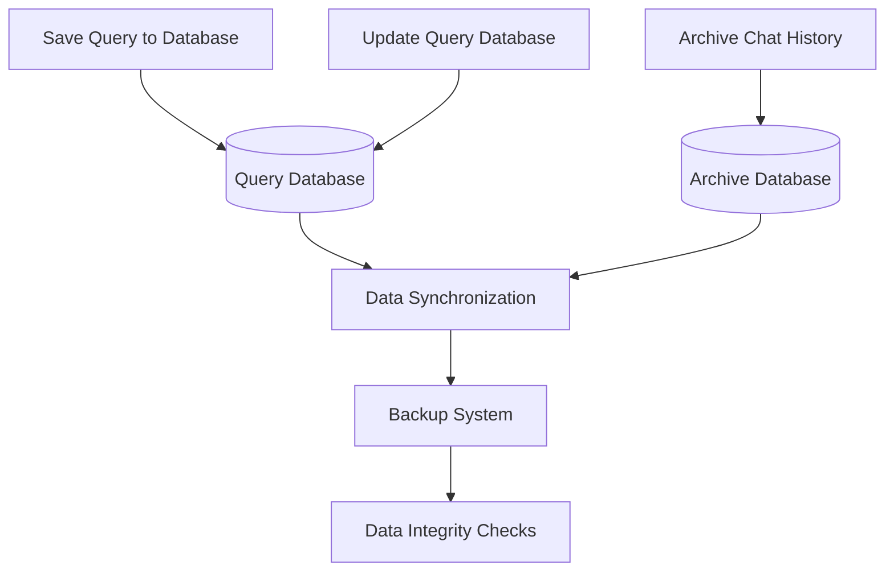
```mermaid
flowchart TB
    SaveQuery[Save Query to Database] --> QueryDB[(Query Database)]
    UpdateDatabase[Update Query Database] --> QueryDB
    ArchiveChat[Archive Chat History] --> ArchiveDB[(Archive Database)]
    
    QueryDB --> DataSync[Data Synchronization]
    ArchiveDB --> DataSync
    DataSync --> BackupSystem[Backup System]
    BackupSystem --> DataIntegrity[Data Integrity Checks]
```

### 10. Monitoring & Analytics
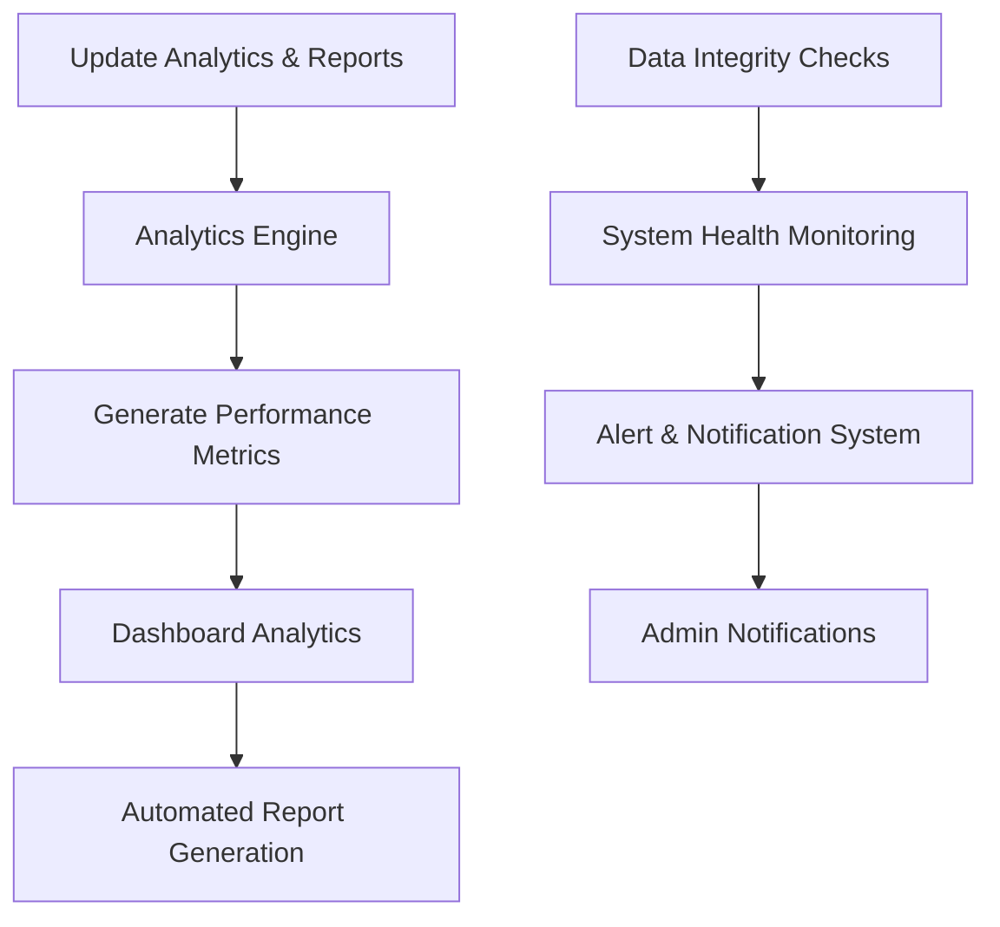
```mermaid
flowchart TB
    UpdateReports[Update Analytics & Reports] --> AnalyticsEngine[Analytics Engine]
    AnalyticsEngine --> GenerateMetrics[Generate Performance Metrics]
    GenerateMetrics --> DashboardAnalytics[Dashboard Analytics]
    DashboardAnalytics --> ReportGeneration[Automated Report Generation]
    
    DataIntegrity[Data Integrity Checks] --> SystemMonitoring[System Health Monitoring]
    SystemMonitoring --> AlertSystem[Alert & Notification System]
    AlertSystem --> AdminNotifications[Admin Notifications]
```

---

## 🔄 Query Action Workflow Details

### Sales Team Actions Workflow
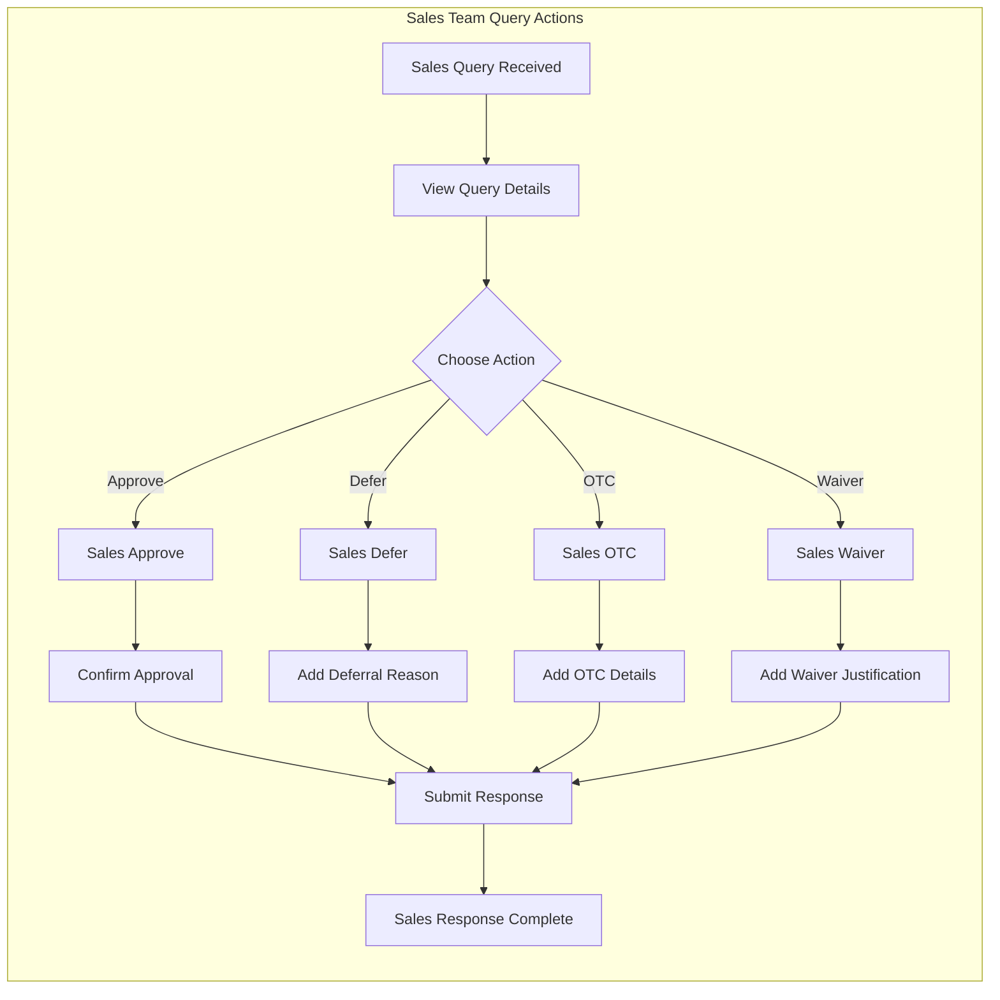
```mermaid
flowchart LR
    subgraph "Sales Team Query Actions"
        SalesQuery[Sales Query Received] --> SalesView[View Query Details]
        SalesView --> SalesAction{Choose Action}
        
        SalesAction -->|Approve| SalesApproveFlow[Sales Approve]
        SalesAction -->|Defer| SalesDeferFlow[Sales Defer]
        SalesAction -->|OTC| SalesOTCFlow[Sales OTC]
        SalesAction -->|Waiver| SalesWaiverFlow[Sales Waiver]
        
        SalesApproveFlow --> SalesApproveConfirm[Confirm Approval]
        SalesDeferFlow --> SalesDeferReason[Add Deferral Reason]
        SalesOTCFlow --> SalesOTCDetails[Add OTC Details]
        SalesWaiverFlow --> SalesWaiverReason[Add Waiver Justification]
        
        SalesApproveConfirm --> SalesSubmit[Submit Response]
        SalesDeferReason --> SalesSubmit
        SalesOTCDetails --> SalesSubmit
        SalesWaiverReason --> SalesSubmit
        
        SalesSubmit --> SalesProcessComplete[Sales Response Complete]
    end
```

### Credit Team Actions Workflow
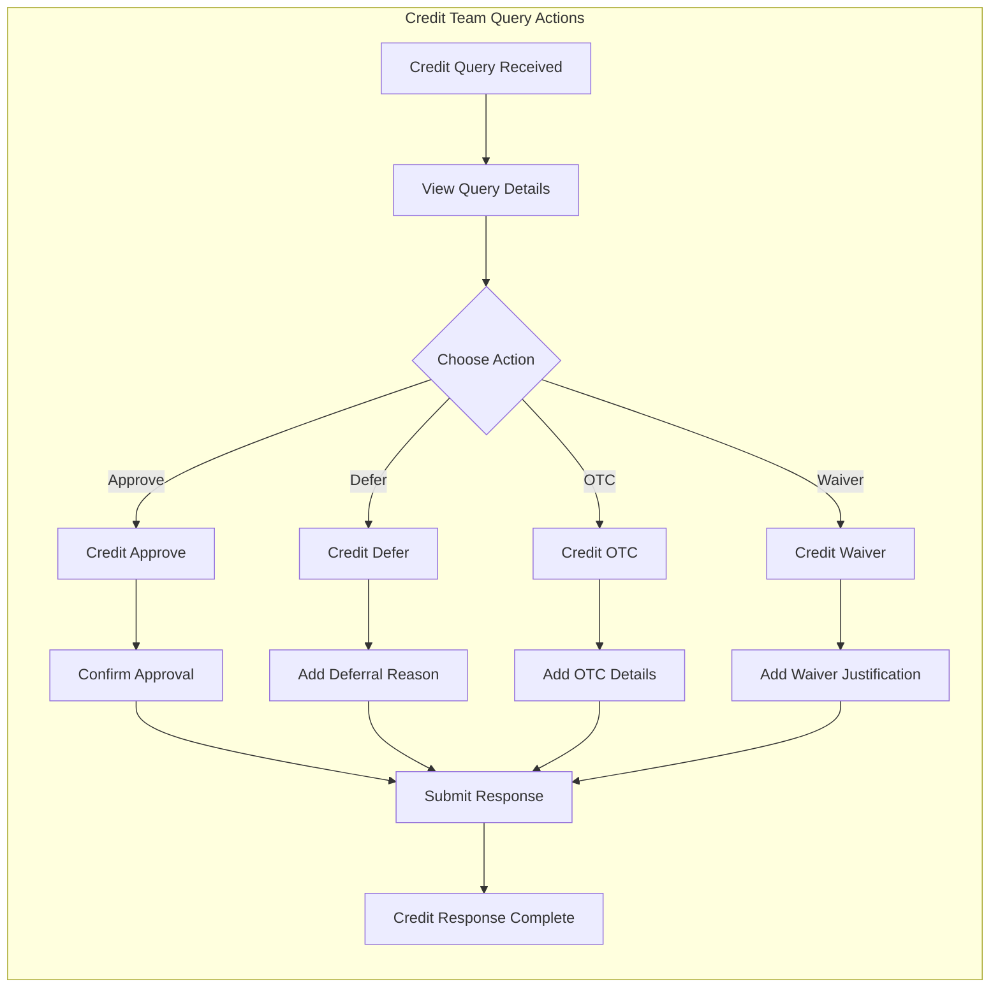
```mermaid
flowchart LR
    subgraph "Credit Team Query Actions"
        CreditQuery[Credit Query Received] --> CreditView[View Query Details]
        CreditView --> CreditAction{Choose Action}
        
        CreditAction -->|Approve| CreditApproveFlow[Credit Approve]
        CreditAction -->|Defer| CreditDeferFlow[Credit Defer]
        CreditAction -->|OTC| CreditOTCFlow[Credit OTC]
        CreditAction -->|Waiver| CreditWaiverFlow[Credit Waiver]
        
        CreditApproveFlow --> CreditApproveConfirm[Confirm Approval]
        CreditDeferFlow --> CreditDeferReason[Add Deferral Reason]
        CreditOTCFlow --> CreditOTCDetails[Add OTC Details]
        CreditWaiverFlow --> CreditWaiverReason[Add Waiver Justification]
        
        CreditApproveConfirm --> CreditSubmit[Submit Response]
        CreditDeferReason --> CreditSubmit
        CreditOTCDetails --> CreditSubmit
        CreditWaiverReason --> CreditSubmit
        
        CreditSubmit --> CreditProcessComplete[Credit Response Complete]
    end
```

---

## 📊 Data Flow Architecture

### Query Creation Data Flow
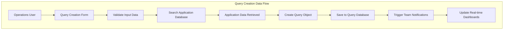
```mermaid
flowchart TD
    subgraph "Query Creation Data Flow"
        OpUser[Operations User] --> CreateForm[Query Creation Form]
        CreateForm --> ValidateInput[Validate Input Data]
        ValidateInput --> SearchApp[Search Application Database]
        SearchApp --> AppData[Application Data Retrieved]
        AppData --> QueryObject[Create Query Object]
        QueryObject --> SaveToDB[Save to Query Database]
        SaveToDB --> TriggerNotifications[Trigger Team Notifications]
        TriggerNotifications --> UpdateDashboards[Update Real-time Dashboards]
    end
```

### Query Response Data Flow

```mermaid
flowchart TD
    subgraph "Query Response Data Flow"
        TeamUser[Sales/Credit User] --> SelectQuery[Select Query]
        SelectQuery --> LoadQueryData[Load Query Data]
        LoadQueryData --> DisplayChat[Display Chat Interface]
        DisplayChat --> UserAction[User Takes Action]
        UserAction --> ValidateAction[Validate Action]
        ValidateAction --> ProcessResponse[Process Response]
        ProcessResponse --> UpdateQueryStatus[Update Query Status]
        UpdateQueryStatus --> BroadcastUpdate[Broadcast Real-time Update]
        BroadcastUpdate --> RefreshAllViews[Refresh All Connected Views]
    end
```

---

## 🔐 Security & Authentication Flow

### Authentication Process
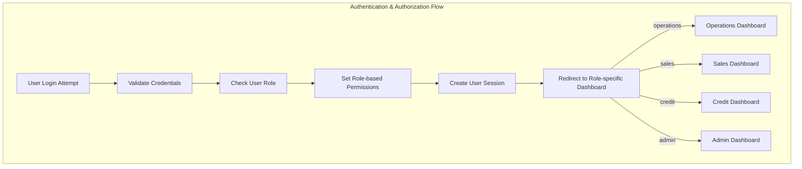
```mermaid
flowchart TB
    subgraph "Authentication & Authorization Flow"
        UserLogin[User Login Attempt] --> ValidateCredentials[Validate Credentials]
        ValidateCredentials --> CheckUserRole[Check User Role]
        CheckUserRole --> SetPermissions[Set Role-based Permissions]
        SetPermissions --> CreateSession[Create User Session]
        CreateSession --> RedirectToDashboard[Redirect to Role-specific Dashboard]
        
        RedirectToDashboard -->|operations| OperationsDash[Operations Dashboard]
        RedirectToDashboard -->|sales| SalesDash[Sales Dashboard]
        RedirectToDashboard -->|credit| CreditDash[Credit Dashboard]
        RedirectToDashboard -->|admin| AdminDash[Admin Dashboard]
    end
```

### API Security Flow
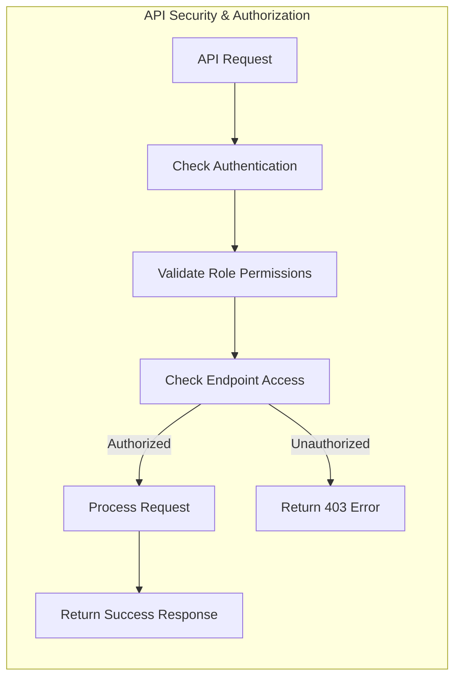
```mermaid
flowchart LR
    subgraph "API Security & Authorization"
        APIRequest[API Request] --> CheckAuth[Check Authentication]
        CheckAuth --> ValidateRole[Validate Role Permissions]
        ValidateRole --> CheckEndpointAccess[Check Endpoint Access]
        CheckEndpointAccess -->|Authorized| ProcessRequest[Process Request]
        CheckEndpointAccess -->|Unauthorized| ReturnError[Return 403 Error]
        ProcessRequest --> ReturnResponse[Return Success Response]
    end
```

---

## 🚀 Real-time System Architecture

### Real-time Update Flow
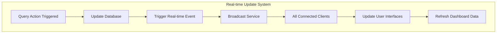
```mermaid
flowchart TB
    subgraph "Real-time Update System"
        QueryAction[Query Action Triggered] --> UpdateDatabase[Update Database]
        UpdateDatabase --> TriggerEvent[Trigger Real-time Event]
        TriggerEvent --> BroadcastService[Broadcast Service]
        BroadcastService --> ConnectedClients[All Connected Clients]
        ConnectedClients --> UpdateUI[Update User Interfaces]
        UpdateUI --> RefreshData[Refresh Dashboard Data]
    end
```

### Chat System Flow
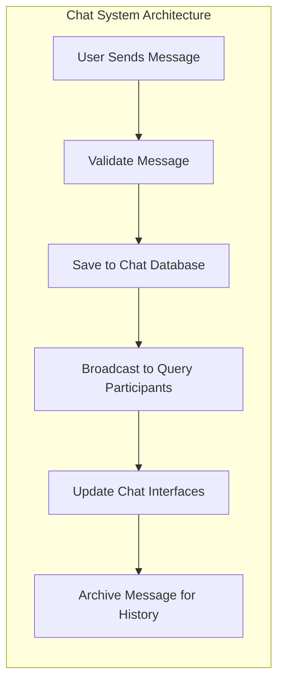
```mermaid
flowchart LR
    subgraph "Chat System Architecture"
        UserMessage[User Sends Message] --> ValidateMessage[Validate Message]
        ValidateMessage --> SaveToDatabase[Save to Chat Database]
        SaveToDatabase --> BroadcastToParticipants[Broadcast to Query Participants]
        BroadcastToParticipants --> UpdateChatInterface[Update Chat Interfaces]
        UpdateChatInterface --> ArchiveMessage[Archive Message for History]
    end
```

---

## 🎯 System Performance & Monitoring

### Performance Monitoring Flow
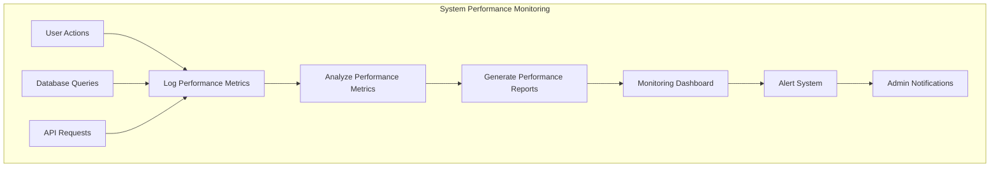
```mermaid
flowchart TD
    subgraph "System Performance Monitoring"
        UserActions[User Actions] --> LogPerformance[Log Performance Metrics]
        DatabaseQueries[Database Queries] --> LogPerformance
        APIRequests[API Requests] --> LogPerformance
        
        LogPerformance --> AnalyzeMetrics[Analyze Performance Metrics]
        AnalyzeMetrics --> GenerateReports[Generate Performance Reports]
        GenerateReports --> MonitoringDashboard[Monitoring Dashboard]
        MonitoringDashboard --> AlertSystem[Alert System]
        AlertSystem --> AdminNotification[Admin Notifications]
    end
```

---

## 📈 Analytics & Reporting Flow

### Analytics Data Pipeline
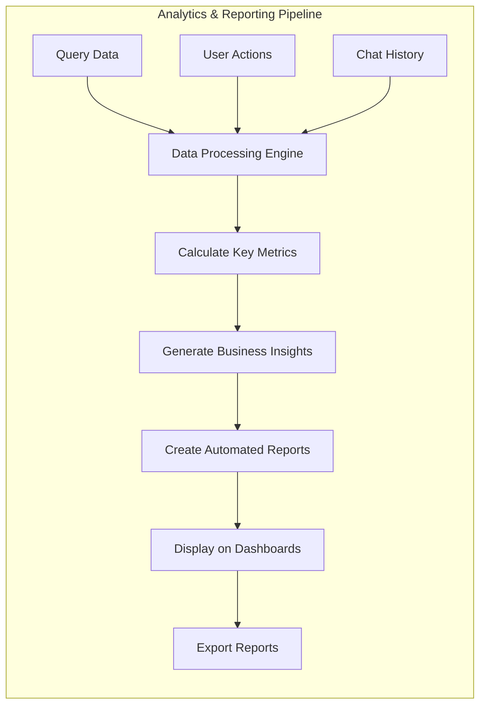
```mermaid
flowchart LR
    subgraph "Analytics & Reporting Pipeline"
        QueryData[Query Data] --> DataProcessor[Data Processing Engine]
        UserActions[User Actions] --> DataProcessor
        ChatHistory[Chat History] --> DataProcessor
        
        DataProcessor --> CalculateMetrics[Calculate Key Metrics]
        CalculateMetrics --> GenerateInsights[Generate Business Insights]
        GenerateInsights --> CreateReports[Create Automated Reports]
        CreateReports --> DashboardDisplay[Display on Dashboards]
        DashboardDisplay --> ExportReports[Export Reports]
    end
```

---

## 🔄 Complete System Integration Flow

### End-to-End Process Flow
```mermaid
flowchart TB
    subgraph "Complete OpsQuery System Integration"
        
        subgraph "Input Layer"
            A1[Operations Creates Query] 
            A2[Sales/Credit Responds]
            A3[Admin Manages System]
        end
        
        subgraph "Processing Layer"
            B1[Authentication & Authorization]
            B2[Data Validation & Processing]
            B3[Business Logic Execution]
            B4[Real-time Event Broadcasting]
        end
        
        subgraph "Data Layer"
            C1[Query Database]
            C2[User Database]
            C3[Chat Archive Database]
            C4[Analytics Database]
        end
        
        subgraph "Output Layer"
            D1[Real-time Dashboards]
            D2[Analytics & Reports]
            D3[Notifications & Alerts]
            D4[Audit Trails]
        end
        
        A1 --> B1
        A2 --> B1
        A3 --> B1
        
        B1 --> B2
        B2 --> B3
        B3 --> B4
        
        B2 --> C1
        B2 --> C2
        B3 --> C3
        B4 --> C4
        
        C1 --> D1
        C2 --> D1
        C3 --> D2
        C4 --> D2
        
        B4 --> D3
        B3 --> D4
    end
```

---

## 🎯 Key System Features

### Core Capabilities

1. **Role-Based Access Control**: Operations creates queries, Sales/Credit responds
2. **Real-time Communication**: Instant messaging and live updates
3. **Comprehensive Audit Trail**: Complete history of all actions and communications
4. **Advanced Analytics**: Business intelligence and performance metrics
5. **Scalable Architecture**: Supports multiple concurrent users and high transaction volume
6. **Secure Data Management**: Enterprise-grade security with role-based permissions
7. **Automated Workflows**: Streamlined processes with minimal manual intervention
8. **Mobile-Responsive Design**: Accessible from any device

### Technical Excellence

- **Next.js 15 with App Router**: Modern React framework for optimal performance
- **TypeScript**: Type safety and enhanced developer experience  
- **MongoDB with Replica Sets**: Scalable database with high availability
- **Real-time Updates**: Server-sent events for instant synchronization
- **Responsive Design**: TailwindCSS for consistent UI across devices
- **API-First Architecture**: RESTful APIs with comprehensive endpoint coverage

---

*This comprehensive workflow chart represents the complete OpsQuery system architecture, covering all user journeys, data flows, and system integrations. The system is designed for enterprise-grade financial query management with real-time collaboration capabilities.*

## 🔒 Security & Access Control Matrix

```mermaid
flowchart LR
    subgraph "Security Layer"
        Auth[Authentication System]
        RoleValidation[Role Validation]
        APIProtection[API Protection]
    end
    
    subgraph "Operations Team (Full Access)"
        OpCreate[✅ Create Queries]
        OpView[✅ View All Queries]  
        OpApproval[✅ Request Approvals]
        OpArchive[✅ View Archives]
    end
    
    subgraph "Sales Team (View & Respond)"
        SalesView[✅ View Assigned Queries]
        SalesRespond[✅ Respond to Queries]
        SalesRevert[✅ Revert Queries]
        SalesNoCreate[❌ Cannot Create Queries]
    end
    
    subgraph "Credit Team (View & Respond)"
        CreditView[✅ View Assigned Queries]
        CreditRisk[✅ Risk Assessment]
        CreditRespond[✅ Respond to Queries]
        CreditNoCreate[❌ Cannot Create Queries]
    end
    
    subgraph "Approval Team (Decision Making)"
        ApprovalReview[✅ Review Requests]
        ApprovalDecide[✅ Approve/Reject/Defer]
        ApprovalHistory[✅ Track Decisions]
        ApprovalNoCreate[❌ Cannot Create Queries]
    end
    
    subgraph "Admin Team (System Management)"
        AdminUsers[✅ User Management]
        AdminBranch[✅ Branch Management]
        AdminBulk[✅ Bulk Operations]
        AdminNoQuery[❌ No Query Access]
    end
    
    Auth --> RoleValidation
    RoleValidation --> APIProtection
    
    APIProtection -->|operations role| OpCreate
    APIProtection -->|sales role| SalesView
    APIProtection -->|credit role| CreditView
    APIProtection -->|approval role| ApprovalReview
    APIProtection -->|admin role| AdminUsers
    
    OpCreate -.->|403 Forbidden| SalesNoCreate
    OpCreate -.->|403 Forbidden| CreditNoCreate
    OpCreate -.->|403 Forbidden| ApprovalNoCreate
    OpCreate -.->|403 Forbidden| AdminNoQuery
```

## 🏗️ System Architecture Overview

```mermaid
flowchart TD
    subgraph "Frontend Layer"
        OpUI[Operations Dashboard]
        SalesUI[Sales Dashboard]
        CreditUI[Credit Dashboard]
        ApprovalUI[Approval Dashboard]
        AdminUI[Admin Dashboard]
    end
    
    subgraph "API Layer"
        QueriesAPI[Queries API<br/>🔒 POST: Operations Only]
        QueryActionsAPI[Query Actions API<br/>💬 Messages & Workflow]
        ApprovalsAPI[Approvals API<br/>✅ Decision Workflow]
        AuthAPI[Authentication API<br/>🔐 Role Validation]
        UsersAPI[Users API<br/>👥 User Management]
    end
    
    subgraph "Business Logic"
        QueryModel[Query Model]
        UserModel[User Model]
        ChatService[Chat Storage Service]
        ApprovalService[Approval Service]
        RealTimeService[Real-time Updates]
    end
    
    subgraph "Data Layer"
        MongoDB[(MongoDB Database)]
        ChatArchive[(Chat Archives)]
        QueryEvents[(Query Events)]
        UserSessions[(User Sessions)]
    end
    
    %% Frontend to API connections
    OpUI -->|CREATE queries| QueriesAPI
    OpUI -->|messages & actions| QueryActionsAPI
    SalesUI -->|view & respond| QueriesAPI
    SalesUI -->|messages| QueryActionsAPI
    CreditUI -->|view & respond| QueriesAPI
    CreditUI -->|messages| QueryActionsAPI
    ApprovalUI -->|decisions| ApprovalsAPI
    AdminUI -->|user management| UsersAPI
    
    %% API to Business Logic
    QueriesAPI --> QueryModel
    QueryActionsAPI --> ChatService
    ApprovalsAPI --> ApprovalService
    AuthAPI --> UserModel
    
    %% Business Logic to Data
    QueryModel --> MongoDB
    ChatService --> ChatArchive
    ApprovalService --> QueryEvents
    UserModel --> UserSessions
    
    %% Real-time updates
    RealTimeService --> OpUI
    RealTimeService --> SalesUI
    RealTimeService --> CreditUI
    RealTimeService --> ApprovalUI
    
    QueryModel --> RealTimeService
    ChatService --> RealTimeService
    ApprovalService --> RealTimeService
```

## 🔄 Query Lifecycle States

```mermaid
stateDiagram-v2
    [*] --> Created
    
    Created --> Pending : Operations creates query
    Pending --> InProgress : Team starts working
    
    InProgress --> DirectResolution : Team provides direct answer
    InProgress --> RevertToPending : Team reverts with feedback
    InProgress --> ApprovalRequested : Team requests approval
    
    ApprovalRequested --> WaitingApproval : Sent to approval team
    
    WaitingApproval --> Approved : Approval team approves
    WaitingApproval --> Deferred : Approval team defers
    WaitingApproval --> OTC : Approval team marks as OTC
    WaitingApproval --> Rejected : Approval team rejects
    
    Rejected --> Pending : Back to operations
    RevertToPending --> Pending : Back to operations
    
    DirectResolution --> Resolved : Query completed
    Approved --> Resolved : Query completed
    Deferred --> Resolved : Query completed
    OTC --> Resolved : Query completed
    
    Resolved --> ChatArchived : Chat history archived
    ChatArchived --> [*] : Process complete
    
    note right of Created
        Only Operations team
        can create queries
    end note
    
    note right of ApprovalRequested
        BIZLN approval request
        generated with unique ID
    end note
    
    note right of ChatArchived
        Complete chat history
        stored for compliance
    end note
```

## 🚀 Real-time Communication Flow

```mermaid
sequenceDiagram
    participant Ops as Operations Team
    participant API as Query Actions API
    participant DB as MongoDB
    participant RT as Real-time Service
    participant Sales as Sales Team
    participant Credit as Credit Team
    participant Approval as Approval Team
    
    Note over Ops,Approval: Query Creation & Distribution
    
    Ops->>API: Create Query (POST /api/queries)
    API->>DB: Store Query
    API->>RT: Broadcast "query created"
    RT->>Sales: Notify if assigned to Sales
    RT->>Credit: Notify if assigned to Credit
    RT->>Approval: Log for potential escalation
    
    Note over Ops,Approval: Team Response & Communication
    
    Sales->>API: Send Message (POST /api/query-actions)
    API->>DB: Store Message
    API->>RT: Broadcast "new message"
    RT->>Ops: Notify Operations
    RT->>Credit: Notify if both teams assigned
    RT->>Approval: Notify if escalated
    
    Note over Ops,Approval: Approval Workflow
    
    Sales->>API: Request Approval (POST /api/query-actions)
    API->>API: Create BIZLN Approval Request
    API->>DB: Update Query Status to "Waiting"
    API->>RT: Broadcast "pending approval"
    RT->>Approval: Notify Approval Team
    RT->>Ops: Update Operations Dashboard
    
    Approval->>API: Make Decision (POST /api/approvals)
    API->>DB: Update Query & Archive Chat
    API->>RT: Broadcast "query resolved"
    RT->>Ops: Notify Operations
    RT->>Sales: Notify Sales
    RT->>Credit: Notify Credit
    
    Note over Ops,Approval: Chat Archiving
    
    API->>DB: Archive Complete Chat History
    DB-->>API: Archival Complete
    API->>RT: Broadcast "chat archived"
    RT->>Ops: Show in Archive Section
```

## 🔐 API Security Implementation

```mermaid
flowchart LR
    subgraph "Request Flow"
        Client[Client Request]
        Headers[Headers Check]
        RoleAuth[Role Authentication]
        EndpointAccess[Endpoint Access Control]
    end
    
    subgraph "Security Validations"
        UserRole[x-user-role Header]
        UserID[x-user-id Header]
        AuthToken[Authorization Token]
    end
    
    subgraph "Protected Endpoints"
        QueryCreate[POST /api/queries<br/>🔒 Operations Only]
        QueryActions[POST /api/query-actions<br/>💬 All Teams]
        Approvals[POST /api/approvals<br/>✅ Approval Team]
        UserMgmt[POST /api/users<br/>⚙️ Admin Only]
    end
    
    subgraph "Response Types"
        Success[200 Success]
        Forbidden[403 Forbidden]
        Unauthorized[401 Unauthorized]
        BadRequest[400 Bad Request]
    end
    
    Client --> Headers
    Headers --> RoleAuth
    RoleAuth --> EndpointAccess
    
    Headers --> UserRole
    Headers --> UserID
    Headers --> AuthToken
    
    EndpointAccess -->|operations role| QueryCreate
    EndpointAccess -->|any authenticated| QueryActions
    EndpointAccess -->|approval role| Approvals
    EndpointAccess -->|admin role| UserMgmt
    
    QueryCreate -->|valid| Success
    QueryCreate -->|invalid role| Forbidden
    QueryActions -->|valid| Success
    Approvals -->|valid| Success
    UserMgmt -->|valid| Success
    
    RoleAuth -->|invalid| Unauthorized
    Headers -->|missing| BadRequest
```

## 📋 Key Features Summary

### 🔒 Operations Team (Query Creation Hub)

- ✅ **Exclusive Query Creation**: Only team that can create new queries
- ✅ **Application Search**: Search sanctioned applications for query context
- ✅ **Team Assignment**: Assign queries to Sales, Credit, or Both teams
- ✅ **Approval Workflow**: Manage BIZLN approval requests
- ✅ **Chat Archives**: Access complete chat history for compliance

### 👥 Sales & Credit Teams (Response & Resolution)

- ✅ **View Assigned Queries**: See queries assigned to their team
- ✅ **Real-time Messaging**: Chat with other teams and operations
- ✅ **Direct Resolution**: Resolve queries directly or request approval
- ✅ **Revert Functionality**: Send queries back to operations with feedback
- ❌ **No Query Creation**: Cannot create new queries (security restriction)

### ⚙️ Admin Team (System Management)

- ✅ **User Management**: Create and manage user accounts and roles
- ✅ **Branch Management**: Configure branches and assignments  
- ✅ **Bulk Operations**: Handle bulk data uploads and management
- ✅ **System Configuration**: Manage system-wide settings
- ❌ **No Query Operations**: Focused on system administration only

### 🔄 System-wide Features

- 🚀 **Real-time Updates**: Live synchronization across all dashboards
- 💾 **Chat Archiving**: Complete chat history preservation for compliance
- 📊 **Analytics & Reporting**: Comprehensive metrics and performance tracking
- 🔒 **Role-based Security**: Strict access control and permission management
- 📱 **Responsive Design**: Works across desktop and mobile devices
- ⚡ **High Performance**: Optimized for scale with MongoDB and Next.js 
